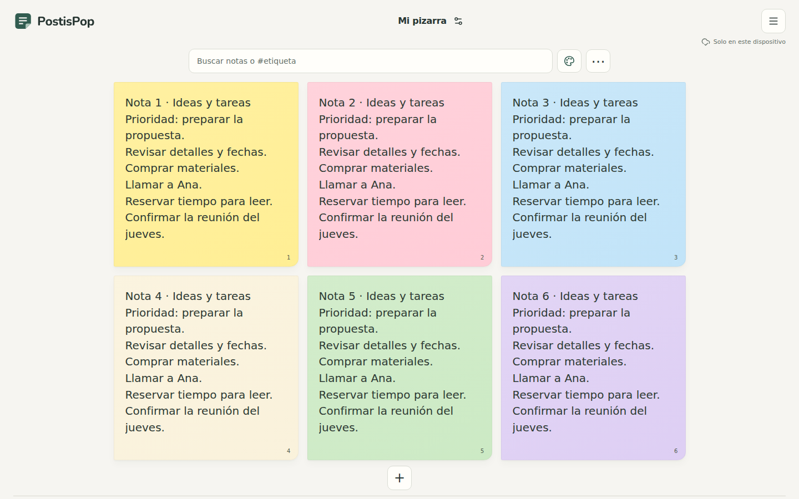
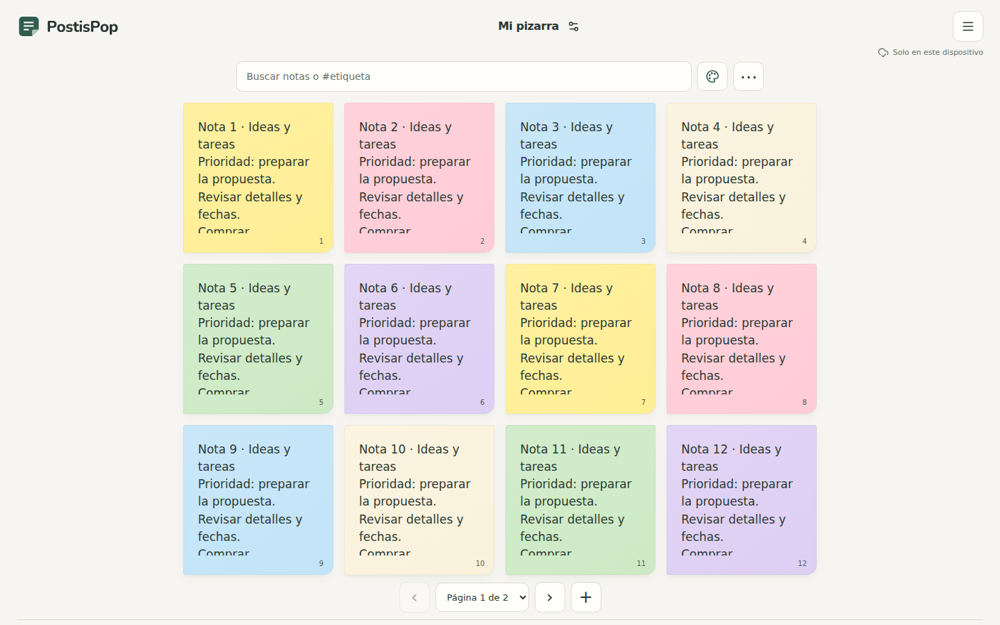
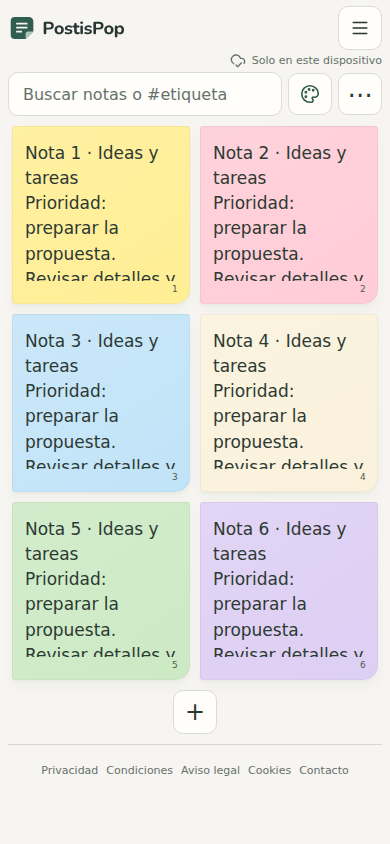
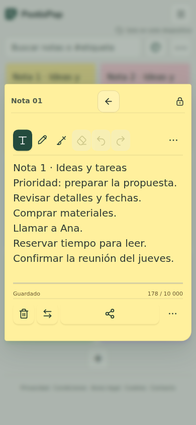
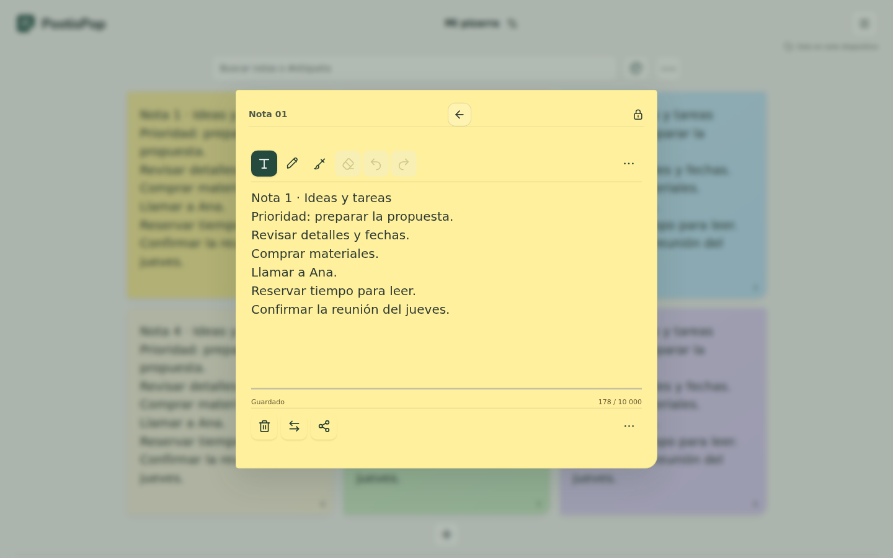

# Validación web de PostisPop — 6 de octubre de 2026

La experiencia principal está comprobada en navegador: notas grandes y cuadradas, navegación entre páginas, búsqueda global, escritura inmediata, dibujo y guardado local. Las pruebas descritas aprobaron sus recorridos. Esto no acredita ausencia total de fallos, superioridad frente a otras aplicaciones ni publicación de esta versión.

**Estado de cierre:** la validación visual está terminada. La corrida integrada final de `npm test` pasa **139/139, sin omisiones**, también en una copia limpia sin sitio preparado. La creación atómica de pizarras pasa sus 14 pruebas específicas y la suite PostgreSQL local completa. El último cambio afecta al acceso remoto mediante `supabase-bridge.js`, no al primer pintado medido.

## Versiones y alcance

| Evidencia | Versión comprobada | Alcance |
| --- | --- | --- |
| Axe, Lighthouse y cinco capturas | `9d72c9ee3e3b048d89aeca7b46915a616387ee3c245bd1a1f70a4cd33f393564` | Bundle web aislado 0.5.0, 198 archivos, sin editar durante la medición |
| Tablero, botón + e hidratación | `691465d3f43c9142f82e80aea51866eb73d8e957aa0618b07e0116e4bfc53208` | Versión anterior al ajuste final de contraste y a la limpieza del paquete; 13 escenarios, 5 casos de + y 20 recargas |
| Experiencia completa | Prefijo `415734c6` | Prueba de integración que reproduce la recarga temprana y comprueba recorridos locales |
| Artefacto web posterior al RPC | `5a5aef4e3ac04bb95d4b27127d81c03c1b914561e2feba865ec0a72a0a008ecc` | 198 archivos; interfaz y CSS sin cambios respecto a la auditoría visual |
| Unitarias | 139/139 después del último RPC | Corrida final sin omisiones; repetida sobre una copia limpia sin sitio preparado. RPC 14/14 y PostgreSQL local completo aprobados |

El informe estructurado está en [QA_20261006.json](QA_20261006.json). Las métricas permanecen vinculadas al hash auditado aunque se incorporen después cambios remotos. No se atribuyen automáticamente a cualquier commit o despliegue posterior. La comparación de manifiestos entre ambos artefactos cambia únicamente `supabase-bridge.js` y `sw.js`; la interfaz y el CSS medidos permanecen iguales. La nueva medición no se repite ni se mezcla con las anteriores.

## Pruebas funcionales aprobadas

| Prueba | Resultado | Qué comprueba |
| --- | --- | --- |
| `tests/notes-first-ui.cjs` | **13/13** | Seis notas gratuitas, proporciones cuadradas, 3 × 2 en escritorio y 2 × 3 en móvil; 24 notas heredadas accesibles por páginas de 12/6; búsqueda de la última página, estados sin coincidencias y conservación de datos |
| `tests/add-note-ui.cjs` | **5/5** | + reutiliza una nota realmente vacía con foco; respeta las seis ocupadas; limpia filtros y abre huecos de otras páginas; excluye notas con adjuntos; abre una creación autorizada en su página |
| `tests/hydration-ui.cjs` | **20 recargas y eventos anticipados aprobados** | La interfaz conserva el HTML inicial mientras React carga; abrir el editor y recargar inmediatamente no provoca la carrera de hidratación detectada |
| `tests/experience-ui.cjs` | **Aprobada** | Español inicial, estado de guardado veraz, edición local offline, JSON/PNG, importación segura sin sobrescribir, rechazo de copia insegura, foco, instalación/descargas, oferta Próximamente y ocho guías |
| `npm test` | **139/139, sin omisiones** | Corrida integrada final después del RPC; también aprobada en una copia limpia sin sitio preparado |
| `npm run test:backup` | **3 casos aprobados** | Dos pruebas del módulo y una integración de navegador con artefacto preparado; la prueba de navegador se ejecuta después de preparar el sitio |

En los trece escenarios del tablero no se registraron excepciones de página ni errores de consola. Se probaron **320 × 568, 390 × 844, 768 × 1024, 1366 × 768 y 1440 × 900**. El editor se abre en modo texto; se comprobaron lápiz, deshacer/rehacer, vuelta a escritura y persistencia de texto/dibujo al recargar y volver atrás. La navegación incluye botones, selector y gesto horizontal sin abrir una nota por accidente.

Los datos son sintéticos. Las peticiones se sirven desde archivos preparados o se bloquean; estas pruebas no envían notas a producción ni certifican una sesión real de Supabase. La creación autorizada del test utiliza una respuesta controlada, no un pago ni una concesión Premium real.

## Otros recorridos de integración comprobados

Las pruebas siguientes se comunicaron aprobadas sobre el payload `691465d3`; su alcance no se extiende al servidor de producción.

| Prueba | Resultado y entorno |
| --- | --- |
| `tests/protected-share-ui.cjs` | Aprobada; interfaz preparada con RPC de compartición cifrada simulado |
| `tests/protected-concurrency-ui.cjs` | Aprobada; coordinación entre dos pestañas reales y datos controlados |
| `tests/premium-ui.cjs` | Aprobada; invitado local real y denegaciones controladas, sin cobro |
| `tests/cloud-import-ui.cjs` | Aprobada; backend simulado y reintentos idempotentes |
| `tests/autosave-ui.cjs` | Aprobada; persistencia y cierre con opciones móviles |
| `tests/offline-shell-ui.cjs` | Aprobada; service worker real con el servidor HTTP local detenido |
| Respaldo de adjuntos en navegador | Tres casos aprobados con IndexedDB real, offline, cuota y reintento; los ocho módulos superpuestos desde source coincidían byte a byte con el payload |

La corrección posterior de `database/board-create.sql` y `supabase-bridge.js` cuenta con **14 pruebas de `offline-bridge.test.cjs` aprobadas** y una ejecución PostgreSQL local con PGlite que añade **24 comprobaciones** de rollback ante fallo del sembrado, RLS, seis notas gratuitas, doce iniciales para pago e idempotencia. Es evidencia local de la transacción: **no se ha aplicado ni probado ese cambio en Supabase de producción**. La suite PostgreSQL local completa también ha terminado correctamente. El artefacto posterior al RPC tiene el hash indicado en la tabla y la corrida integrada final de `npm test` pasa 139/139.

## Accesibilidad automática

**Axe: 10 estados comprobados y cero violaciones**, cubriendo pizarra y editor en los cinco tamaños. Se espera a que terminen las animaciones antes de medir; no se confunden colores transitorios de una apertura con el estado estable.

Se corrigieron etiquetas accesibles, elementos que se movían durante la hidratación y contraste del pie y del estado/contador del editor. La revisión automática no sustituye ensayos con lectores de pantalla, teclado y dispositivos reales.

## Rendimiento local: mediana de tres

Lighthouse **13.5.0**, Chromium **141.0.7390.37**. Servidor estático local con gzip, perfiles móvil/escritorio y red externa bloqueada. Son tres ejecuciones por perfil, con la mediana calculada por métrica; no se selecciona solamente la mejor muestra.

| Métrica | Móvil | Escritorio |
| --- | ---: | ---: |
| Rendimiento | **85/100** | **100/100** |
| Accesibilidad Lighthouse | 100/100 | 100/100 |
| Buenas prácticas | 100/100 | 100/100 |
| SEO | 100/100 | 100/100 |
| First Contentful Paint | 2,851 s | 0,657 s |
| Largest Contentful Paint | 3,640 s | 0,717 s |
| Total Blocking Time | 0 ms | 0 ms |
| Cumulative Layout Shift | 0,008354 | 0,003056 |
| Transferencia inicial | 362.140 bytes | 362.140 bytes |

Las muestras de rendimiento fueron **85, 85 y 86 en móvil**, y **100, 99 y 100 en escritorio**. El móvil conserva margen de mejora en carga inicial; no se alcanzó una mediana de 90. Los informes completos de cada ejecución se generan en `test-results/quality/`; el JSON de esta carpeta conserva puntuaciones, métricas, tamaños y procedencia.

## Lighthouse local y PageSpeed público no son la misma prueba

La [auditoría competitiva](AUDITORIA_COMPETITIVA_20261006.md) conserva la medición pública de PostisPop de las **06:59 UTC del 6 de octubre**: rendimiento **58 móvil / 72 escritorio**, en la versión pública anterior. No había datos CrUX disponibles para PostisPop.

| Contexto | Qué se midió | Interpretación válida |
| --- | --- | --- |
| PageSpeed público | URL pública, versión anterior, infraestructura y perfil de Google | Línea base externa de esa versión |
| Lighthouse de este documento | Archivos del hash auditado, servidor local gzip, tres muestras, Chromium local | Comportamiento de laboratorio del candidato aislado |

No se presenta la diferencia entre ambas puntuaciones como una mejora controlada ni como una victoria frente a competidores. Después de publicar se necesita una medición nueva de la URL pública para acreditar su comportamiento desplegado.

## Capturas del bundle auditado

Las capturas siguientes contienen datos de prueba y pertenecen al hash visual indicado. El JSON incluye sus dimensiones, tamaños y SHA-256.

### Escritorio: seis notas



### Escritorio: doce notas de una colección de veinticuatro



### Móvil: seis notas



### Editor en móvil



### Editor en escritorio



## Límites de esta validación

Las compras nuevas siguen desactivadas con **Próximamente**. Este informe no acredita cobros, migraciones aplicadas al servidor, sincronización entre cuentas/dispositivos reales, colaboración completa ni todas las funciones de los competidores. Para el estado remoto, consultar [la entrega de datos y límites](../database/DELIVERY_20261006.md); para compilación, firma, recursos del APK e instalación, consultar [la validación Android](ANDROID_VALIDACION_20261006.md).

La corrección final del RPC atómico cuenta con sus 14 pruebas específicas, la suite PostgreSQL local completa y la corrida integrada final de 139/139 aprobadas. Las pruebas de respaldo conservan tres casos; la integración de navegador requiere el artefacto preparado y se ejecuta separadamente de las pruebas unitarias. Las métricas visuales permanecen atribuidas al build auditado, cuya presentación no cambió.

## Reproducción

```sh
npm test
node tests/notes-first-ui.cjs
node tests/add-note-ui.cjs
node tests/hydration-ui.cjs
node tests/experience-ui.cjs
POSTISPOP_SITE_ROOT=/ruta/al/sitio-preparado node scripts/audit-quality.mjs --lighthouse --lighthouse-runs=3
```

Preparar el sitio con el manifiesto y hash que se pretenden comprobar. No mezclar muestras Lighthouse de builds diferentes. Los comandos de navegador usan archivos locales y bloqueo de tráfico externo.
